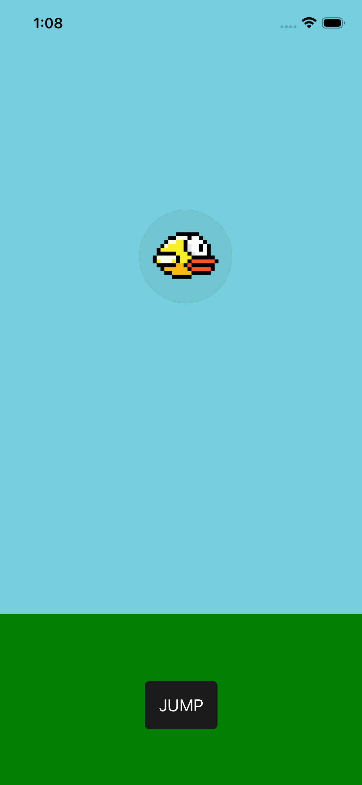
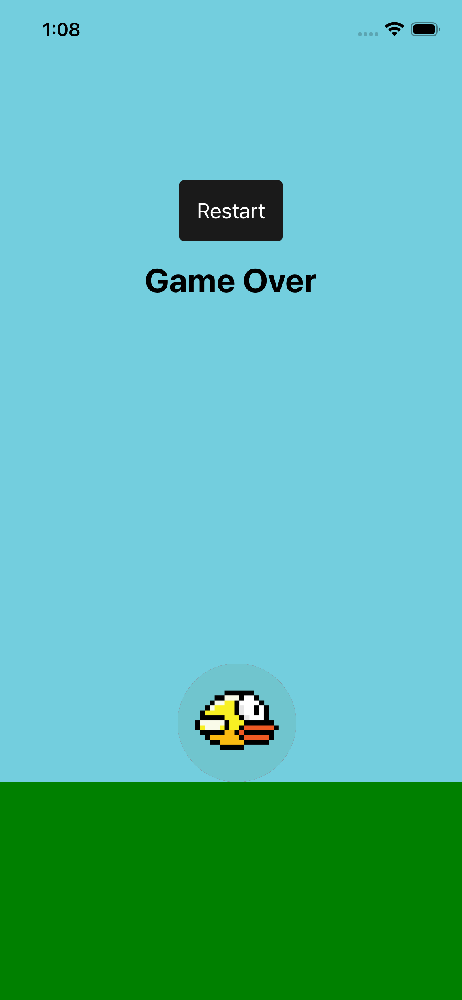

## My Idea: 

- Voice Bird is a Flappy Bird–inspired mobile game built using React Native where the player controls the bird using voice input instead of touch.

- The louder the sound, the higher the bird flies. The goal is to pass through obstacles without crashing.

---

### I'm In very Intial Stage of Developemnt Right Know

    
    

